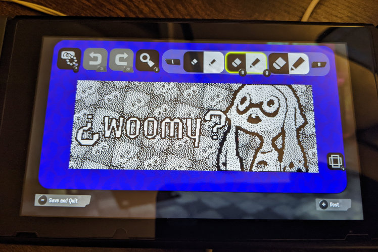

# img2splat

img2splat is inspired by [this tool](https://github.com/shinyquagsire23/Switch-Fightstick) that plunks images into
Splatoon posts with a programmable microcontroller. It generates macros for [NXBT](https://github.com/Brikwerk/nxbt),
which allows you to directly control a Nintendo Switch from a Linux computer/VM over Bluetooth. It is intended to work
with Splatoon 3, but might work with earlier titles.

## Getting your image into Splatoon

1. Install [NXBT](https://github.com/Brikwerk/nxbt) and verify connectivity with your Switch by running the demo
    1. Some have reported issues with running very long macros with NXBT where it skips inputs.
       I [made a fork](https://github.com/JonathanNye/nxbt/tree/experiment/busy-wait) that tries to address some of the
       timing issues. If you want to try using this fork, clone the linked branch and...
        1. On Linux systems, instead of doing `sudo pip3 install nxbt`, do `pip3 install -e .` from the root of the repo
        2. On Windows/macOS, follow the instructions in the readme, but make sure you choose to install NXBT from local
           files.
2. Make a 320 x 120 image
    1. The image does not necessarily need to be black and white. img2splat will look at the luminance of each pixel to
       decide if it should be black or white
    2. If you want [dithering](https://en.wikipedia.org/wiki/Dither) in your image to approximate shades of grey,
       img2splat will _not_ do that for you. Graphics software like [the GIMP](https://www.gimp.org/) can dither your
       image for you
    3. A lossless format like PNG is probably ideal
3. Run img2splat with your image as the input, which will spit out a handful of files:
    1. `splat_macro.txt`/`splat_macro_inverted.txt`: These are actual list of commands for NXBT to run. You choose *one*
       of these -- probably the one with fewer operations.
    2. `macro_preview.png`/`macro_preview_inverted.png`: previews of what the generated macros would draw on the canvas
    3. More on running img2splat and its options [below](#running-img2splat)
4. Open Splatoon 3 and start editing a post
    1. Ensure the canvas is in the wider "horizontal" mode
    2. [Choose a macro and prepare your canvas](#macro-types-and-canvas-preparation). How you do this depends on which
       macro you choose to run, but to start you'll either clear the canvas or fill it with black pixels.
    3. Select the smallest, single-pixel brush size
    4. Move the cursor to the **upper-left** corner of the canvas
5. Run NXBT with the macro:
    1. `sudo nxbt macro -c "splat_macro.txt" -r` or `sudo nxbt macro -c "splat_macro_inverted.txt" -r`
    1. The macro should start running after a few moments without any need to pair controllers if you've previously
       paired and run the demo
    2. When the macro finishes, it will press `-` to save in case the Switch is left unattended

## Running img2splat

img2splat needs [Java](https://www.java.com/en/download/) to run. At a minimum, you have to provide an image as the
first argument:

`java -jar img2splat.jar myimage.png`

### Preview Images

In addition to the NXBT macros, images named `macro_preview.png` and `macro_preview_inverted.png` will also be generated
to visually show what the output of the macros might look like. Pixels that each macro will "visit" with the drawing
cursor will be black or white. Any "unvisited" pixels will be blue; this can happen as the result of optimizations or if
you specify repair rows.

### Macro Button Press Duration

You can also specify the length of button presses/releases in the generated macro. By default, buttons are pressed for
0.1 seconds and released for the same. You can override this via the `-pressDuration`/`-d` option:

`java -jar img2splat.jar myimage.png -d 0.05`

A macro with a press duration of 0.05 would run approximately twice as fast as default. The tradeoff, however, is you
may be more likely to run into missed button presses and a compromised image. This ultimately boils down to the
performance of NXBT, your machine, and your Bluetooth adapter.

### Repair Mode

With the `-repairRows`/`-r` option, you can generate a macro that only draws the rows of pixels you specify. This might
be useful if NXBT hitched while drawing a few rows or if your Bluetooth connection broke partway through. Then you can
re-run a "repair" macro and not have to wait for the whole thing to re-draw!

Repair rows can be specified as a comma-separated list of individual pixel rows (e.g. `28`) or a range (e.g. `77-82`).
Values should be between `0` and `119`. Example:

`java -jar img2splat.jar myimage.png -r 28,77-82,100`

Repair macros still start from the upper-left corner of the canvas like regular macros, so most preparation steps are
the same.

### Cautious Mode

You can turn on cautious mode by adding the `-cautious/-c` flag:

`java -jar img2splat.jar myimage.png -c`

By default, generated macros will only move the drawing cursor as far as needed to cover drawing that needs to happen on
the current and next line. This behavior saves time, but the downside is that it can result in more error propagation if
the macro gets out of sync with what's happening on the Switch.

Cautious mode will always move the cursor from one edge of the canvas to the other. It will also add a few extra button
presses to try to ensure the cursor is in fact at the edge of the canvas. If there's an error while drawing a particular
row, this reduces the likelihood of that error resulting *more* errors while drawing subsequent rows.

## Macro Types and Canvas Preparation

img2splat outputs two different NXBT macros: `splat_macro.txt` and `splat_macro_inverted.txt`. Both will draw your
image, but one may be faster than the other.

`splat_macro.txt` will assume that the canvas is starting out totally clear -- full of white pixels. This macro will
traverse the canvas and press `A` to draw black pixels where needed. You can clear the canvas by pressing `L3` (click in
the left stick).

`splat_macro_inverted.txt` will assume that the canvas is starting out fully covered with black pixels. This macro will
traverse the canvas and press `B` to erase pixels where needed. There's no flood fill tool, so I just select the biggest
brush size and scribble all over the canvas until it's covered. :art:

If your image is mostly dark, the `inverted` macro may be faster to run. img2splat will make a suggestion for which you
might want to use.

When running a repair macro to re-draw rows with errors, you'll probably want to "reset" the rows you want re-drawn,
either by erasing them for regular macros or filling them with black pixels for `inverted` macros.
